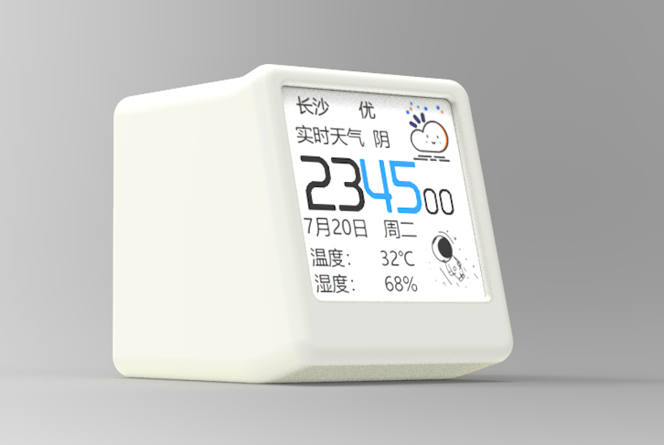

# SmallDesktopDisplay



## Description

相比原版，做了如下改动：

- [x] [修复太空人代码报错](https://github.com/zhangnew/SmallDesktopDisplay/commit/f00e219d092e58ba779a4b3be955c99dc6b7c01b)
- [x] [修复天气不更新的问题](https://github.com/zhangnew/SmallDesktopDisplay/commit/177a9887b00bb58bfab121f21ce5c5e36c6609c5)
- [x] [修复 NTP 时间更新机制(原版会在 WiFi 休眠时更新失败)](https://github.com/zhangnew/SmallDesktopDisplay/commit/adaa7b4f02e187a7ad8397c01106c354f03120c5)
- [x] [串口日志输出添加时间戳](https://github.com/zhangnew/SmallDesktopDisplay/commit/f2d5da7f837646306de75ab2dbe478775198b21b)
- [x] [删除 loop 中重复更新右下角动画](https://github.com/zhangnew/SmallDesktopDisplay/commit/9b36c65241414e32d03063cd8c3b757e524b5138)
- [x] [修复串口命令失效的问题](https://github.com/zhangnew/SmallDesktopDisplay/commit/17788f96137544e1167d95dfd18ab5a7853d9306)
- [x] [可配置: 用农历代替湿度显示](https://github.com/zhangnew/SmallDesktopDisplay/commit/ebc5129690066e4715ce7ddd47d57ecf139f8dd1)
- [x] 精简 loop 中的代码，统一到 Thread 中定时执行
- [x] [更多优化见 commit 记录](https://github.com/zhangnew/SmallDesktopDisplay/commits/main)

## Development

```bash
brew install platformio
# build
pio run -e esp12e
# build and upload
pio run -e esp12e -t upload
```
